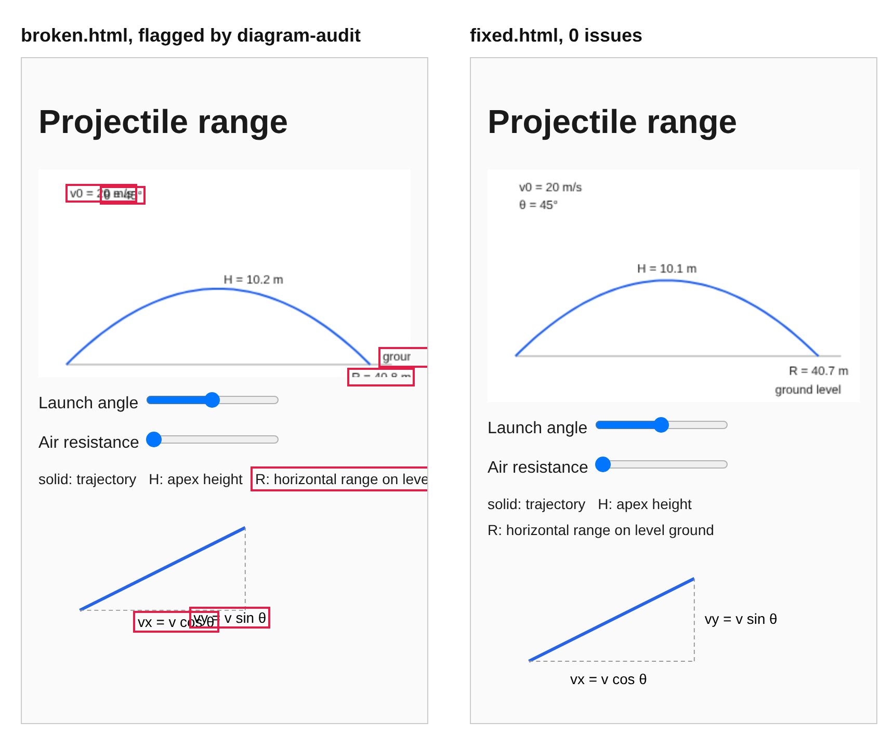

# diagram-audit

[](https://github.com/seegongsik/diagram-audit/actions/workflows/ci.yml)
[](LICENSE)

Find overlapping, clipped and hidden text in canvas, SVG and HTML diagrams, and controls that
do nothing. diagram-audit renders the page in headless Chromium at several widths, moves every
slider and presses every button it finds, and checks where each piece of text actually landed.



## Why

Interactive diagrams are drawn by hand-written code: `ctx.fillText(label, x, y)`. A type checker
or linter cannot tell you that two labels land on the same spot when the screen is 390 px wide,
when a slider is at its maximum, or when the label is in Japanese. A screenshot diff tells you
that something changed, not that it is wrong, and someone has to look at every image.

diagram-audit records the box of every string drawn on a canvas (through `measureText` and the
current transform), every SVG `<text>` and every line of HTML text, then checks the geometry:
text on text, text cut off by the canvas or an `overflow: hidden` box, text hidden under a shape
drawn later, coordinates that are `NaN`, colours the browser cannot parse. It does this for the
resting state and for every state the page's controls can reach.

It was built for [seegongsik.com](https://seegongsik.com), a free interactive STEM learning site
in five languages. Its first full run over the site's 2,085 diagram views, at two widths, flagged
762 of them (37%) with severity 1 or 2 defects. After fixing what it found, the same run reports zero.

## Quick start

diagram-audit is not on npm yet. Install it from GitHub:

```bash
npm install --save-dev github:seegongsik/diagram-audit
npx playwright install chromium
npx diagram-audit https://example.com/your-diagram --vw 1280,390
```

Or try it on the bundled examples:

```bash
git clone https://github.com/seegongsik/diagram-audit && cd diagram-audit
npm install && npx playwright install chromium
npm run demo          # audits examples/broken.html and examples/fixed.html
npm test              # self-test: 16 positive, 19 negative, 8 structural checks
```

Output for `examples/broken.html` at phone width:

```
FAIL  examples/broken.html @390px  S1 3 · S2 3 · S3 0 · dead controls 1 · 1 canvas(es) · 11 state(s)
        S1 TEXT_CLIP                canvas 0  "R = 40.8 m" 54% visible [base, range0=10, range0=28, ...]
        S1 TEXT_CLIP                canvas 0  "ground level" 44% visible [base, range0=10, range0=28, ...]
        S1 TEXT_OVERLAP             canvas 0  "v0 = 20 m/s" x "θ = 45°" overlap 64% [base, range0=10, range0=28, ...]
        S2 SVG_TEXT_OVERLAP         dom       "vx = v cos θ" x "vy = v sin θ" overlap 20% [base, range0=10, range0=28, ...]
        S2 DOM_TEXT_BEYOND_VIEWPORT dom       "R: horizontal range on level ground" 76% visible [base, range0=10, range0=28, ...]
        S2 PAGE_HSCROLL             dom       page scrolls 52px sideways at 390px (widest: span) [base, range0=10, range0=28, ...]
        S2 DEAD_RANGE               control   range #1 "Air resistance" (1 distinct of 5 positions)
```

The list in brackets is every control state in which the defect showed up.

## What it reports

| Severity | Type | Meaning |
|---|---|---|
| 1 | `TEXT_OVERLAP` | two canvas labels overlap by 25% or more |
| 1 | `TEXT_CLIP` · `TEXT_OFFCANVAS` | canvas text less than 90% visible · drawn entirely outside the canvas |
| 1 | `TEXT_OCCLUDED` | an opaque rectangle drawn later covers 50% or more of a label |
| 1 | `NONFINITE` | a drawing call got `NaN` or `Infinity`; the canvas silently skips it, so part of the drawing is missing |
| 1 | `CANVAS_THROW` | a canvas API call threw |
| 1 | `INVALID_COLOR` | a colour string the browser cannot parse (e.g. `'#aaa' + '33'`); the canvas keeps the previous colour without any error |
| 1-2 | `SVG_TEXT_OVERLAP` · `SVG_TEXT_CLIP` · `SVG_TEXT_OFFSVG` | the same checks for SVG `<text>` |
| 1-2 | `DOM_TEXT_OVERLAP` · `DOM_TEXT_CLIPPED` · `DOM_TEXT_BEYOND_VIEWPORT` | the same checks for HTML text |
| 2 | weaker cases of the above | overlap 8-25%, 90-97% visible, 40-50% covered |
| 2 | `BLANK` · `ZERO_SIZE` | a canvas that draws nothing · a canvas with no size |
| 2 | `TEXT_TINY` | canvas text under 6 px (shrinking text is not a fix for an overlap) |
| 2 | `PAGE_HSCROLL` | the page scrolls sideways at this width, with the widest culprits |
| 2 | dead controls | a range input, select, checkbox, button or drag slider that changes nothing; `range-sparse` when a slider reacts at 40% or fewer of the positions tried |
| 3 | `TEXT_ON_EDGE` · `EMPTY_BAND` · `WATERMARK_COVERS` | worth a look, not a verdict |

Severity 1 is "a reader cannot read this". Look at the screenshot (`--shots-dir`) before fixing anything.

## Options

```
diagram-audit [options] <url|file> [<url|file> ...]
diagram-audit summarize <results.jsonl> [...] [--sev N] [--fail-on N|none]

--urls <file>          read URLs (one per line, # comments) from a file
--vw <list>            viewport widths, comma separated (default 1280,390)
--vh <px>              viewport height (default 900)
--dpr <n>              device pixel ratio (default 1; phones are 2-3)
--root <selector>      audit only this subtree (default: body)
--wait-for <selector>  wait for this element after load
--watermark <text>     exact watermark text to keep out of overlap checks
--no-interact          judge the resting state only; do not touch controls
--no-dom               skip SVG and HTML text checks (canvas only)
--positions <n>        positions tried per slider (default 5)
--max-buttons <n>      buttons pressed per page (default 30)
--no-font-normalize    measure with the container's own sans-serif font
--timeout <s>          time limit per page and width (default 90)
--out <file>           write one JSON record per page and width (JSONL)
--shots-dir <dir>      save screenshots of flagged canvases and regions
--shots <n>            screenshots per issue type (default 3)
--sev <n>              list issues up to this severity in the report (default 2)
--fail-on <n|none>     exit 1 if any run has an issue at severity <= n (default 1)
--shard <i/n>          run only every n-th job, starting at i (parallel runs)
--executable-path <p>  use this Chromium binary instead of Playwright's
```

Exit codes: `0` no failing runs, `1` failing runs, `2` usage error or nothing to audit. A run
with no input fails with `2` on purpose: an audit that looked at nothing should never pass.

Local files work too (`diagram-audit dist/lesson.html`). Pages that need a server should be
served first, for example `npx serve dist &` and then `diagram-audit http://localhost:3000/...`.

## In CI

```yaml
- run: npm ci && npx playwright install --with-deps chromium
- run: npm run build && (npx serve -l 4173 dist &) && npx wait-on http://localhost:4173
- run: npx diagram-audit --urls diagram-pages.txt --vw 1280,390 --fail-on 1 --shots-dir audit-shots --out audit.jsonl
- if: failure()
  uses: actions/upload-artifact@v4
  with:
    name: diagram-audit
    path: |
      audit-shots
      audit.jsonl
```

## As a library

```js
import { launchBrowser, auditUrl, summarize } from 'diagram-audit';

const browser = await launchBrowser();
const record = await auditUrl(browser, 'http://localhost:4173/lesson/1', { vw: 390, positions: 7 });
await browser.close();
console.log(summarize([record]));
```

With your own Playwright page, inject the instrumentation before navigation and audit the
page wherever you have it:

```js
import { instrumentScript, auditPage } from 'diagram-audit';

await context.addInitScript(instrumentScript({ root: '#app' }));
await page.goto(url);
// ... log in, open a tab, whatever the page needs
const record = await auditPage(page, { root: '#app', vw: 1280 });
```

`analyzeCanvas`, `analyzeDom` and the thresholds (`THRESH`, `DOM_THRESH`) are exported for
custom pipelines.

## How it works

1. **Instrument.** An init script runs before the page's own code and wraps
   `CanvasRenderingContext2D`: text calls are measured with `measureText`
   (`actualBoundingBox*`) and mapped through the current transform into CSS pixels, so rotated
   and scaled text is placed correctly; paths, rectangles, clips and `save`/`restore` are
   tracked too. Assigning `canvas.width`, a full-canvas `clearRect` or an opaque full-canvas
   `fillRect` starts a new frame, so only what is on screen now is judged. Nothing in the page
   changes.
2. **Exercise.** Range inputs are set to evenly spaced positions, selects to each option,
   checkboxes and buttons are pressed (share, copy, bookmark, close and pager buttons are skipped
   as page chrome, in five languages), and div-based drag sliders are driven with the mouse.
   After each step it waits for finite CSS transitions to finish, so it never measures a frame
   in the middle of an animation.
3. **Judge.** In Node, with convex polygon intersection (Sutherland-Hodgman), so rotated
   labels are compared by their real outline. Outline and shadow passes (the same string drawn
   twice a pixel apart), text erased and redrawn in place, deliberate `clip()`, ellipsis
   truncation, scroll containers and fixed overlays are all recognised and not reported.
4. **Dead controls.** Each state gets a fingerprint (canvas pixels plus DOM markup). A slider
   whose only effect is printing its own value ("230 kV") still counts as dead: the printed
   value is masked in text nodes before fingerprinting, while changes to attributes and other
   text count as a reaction.

## A bug class worth knowing

Most of the defects it found on seegongsik came from one pattern:

```js
const sc = w / 400;                  // layout scales with the width
const h = Math.min(w * 0.6, 240);    // but the height is capped in px
```

On a phone the two agree. On a 560 px desktop column the drawing grows by 40% and the canvas
does not, so everything below the cap falls off the bottom and labels pile up. Scale the cap
with the layout (`Math.min(w * 0.6, 240 * w / 400)`) or drop it. `examples/broken.html` contains
this bug; `TEXT_CLIP` and `TEXT_OFFCANVAS` at wide widths are how it shows up.

## Limitations

- **Font metrics are approximate.** Generic and system UI families (`sans-serif`, `system-ui`,
  Segoe UI, Roboto, Arial and similar) are mapped to Liberation Sans, which has Arial's metrics,
  plus a CJK fallback, when those fonts are installed (`fonts-liberation`, `fonts-wqy-zenhei` on
  Debian/Ubuntu). Widths can still differ from a given user's machine by about 5%, so overlaps
  near the thresholds depend on the reader's fonts. `--no-font-normalize` turns the mapping off.
- **Text against lines and borders is not checked.** It checks text against text, against the
  canvas or clipping box, and against opaque rectangles drawn later. A label crossing a curve or
  a box border needs a look at the screenshot.
- **WebGL canvases cannot be measured.** They are marked `webgl: true`.
- **Modal overlays.** Text behind a modal dialog can be reported as overlapping the dialog's text.
- **No server rendering checks.** Hydration mismatches need a separate check.
- **Animation.** One settled frame per state. Canvases that redraw continuously skip the
  dead-control verdict, because their fingerprint never settles.
- **Navigation.** Form submission is blocked while controls are exercised. A control that still
  navigates away ends the interaction phase for that page and is noted in the record.

## License

MIT, see [LICENSE](LICENSE). The license covers this tool's code. It does not grant any rights
to the seegongsik name or logo, or to the content of seegongsik.com.
